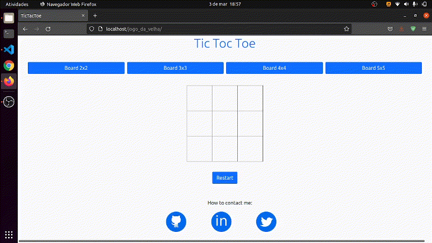

# TicTocToe (Jogo da Velha)

## 🎮 [Play](https://jogo-da-velha-gabrielsanva.vercel.app/)

## About (Sobre)

### English
I made this little project to train mainly my JavaScript skills. It's made with pure JavaScript, HTML and a bit of Bootstrap, just to make it look a little nicer. I think the cool thing about this project is that **the algorithm is generic enough to handle a board of any size.** Feel free to use the *create_board()* function. Have a good time.

### Português
Eu fiz esse pequeno projeto para treinar principalmente minhas habilades em JavaScript. Ele é feito com JavaScript puro, HTML e um pouco de Bootstrap, apenas para tornar a aparência um pouco mais agradável. Eu acho que o legal deste projeto é que **o algoritmo é genérico o suficiente para lidar com um tabuleiro de qualquer tamanho.** Sinta-se a vontade para utilizar a função *create_board()*. Divirta-se.

**Victory 3x3**

**Others boards**

## Next implementations (próximas implementações)

- Scores (placar)
- Player's name (nome dos jogadores)
- Custom symbol (customização dos símbolos)
- Player vs. COM (jogador vs. computador)

## Contact (contato)

- [GitHub](https://github.com/gabrielsanva)
- [LinkedIn](https://www.linkedin.com/in/gabrielsanva/)
- [Twitter](https://twitter.com/gabrielsanva)
